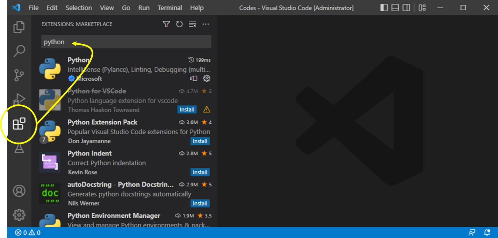
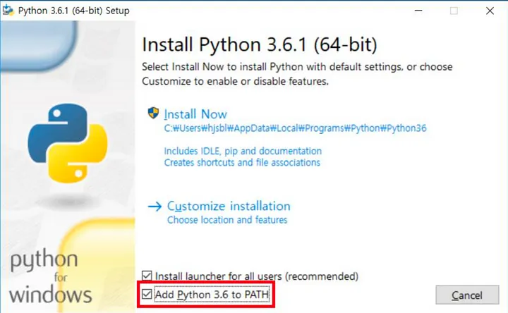
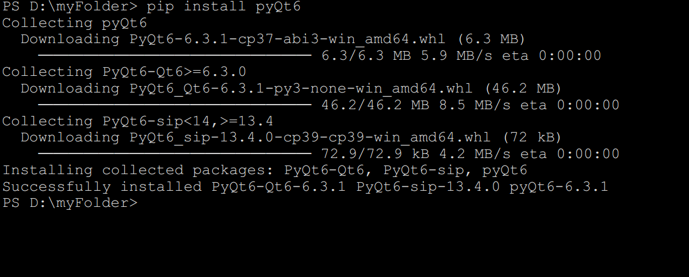

# 00_그래픽스 환경구축

### 설치할것들
1. [vscode](https://code.visualstudio.com/download)   
2. [python 인터프리트](https://www.python.org/downloads/)   
    * opengl   
    * pyQt6

___
### 1.vscode  [-링크-](https://code.visualstudio.com/download)   
설치 후 파이썬 확장 설치   
</img>

 
 
 
 

___

### 2. python  
path“Add Python 3.6 to PATH”를 체크해주길 권장함    
이는 cmd.exe의 어느 디렉토리에 있다 하더라도, 파이썬을 실행 시킬 수 있도록 해주는 것임

</img>

 
 
 
 

___
* opengl   
* pyQt6   

이것들은 python에 내장된 pip를 통해서 다운로드함   
### 3. pyQt6  
cmd창에서 $ pip install pyQt6 명령어를 설치   

 
 
 
 
___
### 4. pyopenGL
cmd창에서 $ pip install pyopenGL 명령어를 설치  

___

