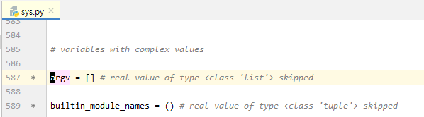

학교에서 그래픽스 수업을 하는데 pyqt를 이용해서 pyopengl을 실습을 하는데 pyqt의 지식이 없으니 opengl을 이해하기가 힘들다. 이번주말에 pyqt를 어느정도 공부를 하고 진도나간데 까지만 복습이 목표

참고자료   
https://www.youtube.com/watch?v=rpWzUj1M4E8&t=213
https://wikidocs.net/119616   
https://pypi.org/project/QtPy/   

___

### 00_PyQt란

<br><br>
___

### 01 PyQt기본구조


<strong> 기본적인 창을 띄우는 코드 살펴보기</strong>
```
import sys 
from PyQt6.QtWidgets import *
app = QApplication(sys.argv)

win = QWidget()
win.show()

app.exec()

```

<br>
<strong><모듈 임포트>  </strong>

 

다음 두 줄의 코드는 sys 모듈과 QtWidgets 모듈을 임포트

```
import sys 
from PyQt6.QtWidgets import *
```

<br>
<strong><앱 객체 생성>  </strong>

 
QtWidgets 모듈에는 QApplication 클래스가 정의되어 있음   
 해당 클래스에 대한 객체를 생성하고 이때 현재 소스코드 파일에 대한 경로를 담고 있는 파이썬 리스트(sys.argv)를 클래스의 생성자로 전달한다.    PyQt6를 이용한 모든 프로그램은 반드시 QApplication 객체를 생성해야한다.
<br>


```
app = QApplication(sys.argv) # 현재 소스코드 파일에 대한 경로를 담고 있는 파이썬 리스트를 클래스의 생성자로 전달
```


<br>
<strong><앱 객체 메서드></strong>

     

생성된 QApplication 객체의 exec 메소드를 호출하여 이벤트 루프를 시작함.   
이벤트 루프가 시작되면 GUI 프로그램은 사용자가 '닫기' 버튼을 누를 때 까지 종료하지 않고 계속 실행   
이벤트 루프는 반복문 내에서 사용자로 부터 입력되는 이벤트를 처리   
ex) 마우스 클릭, 키보드 입력등의 동작


```
app.exec()      # 이벤트 루프 시작
```
<br>

<strong><화면 객체>   </strong>


이벤트 루프를 시작하기 전에 실제로 화면에 보여지는 윈도우에 대한 객체를 생성하고 이를 화면에 보여지도록 show 메소드를 호출해야함   
show 메소드를 호출하지 않으면 객체가 메모리에만 생성될 뿐 화면에는 보여지지 않게 된다.


```
win = QWidget()             # 화면 객체 win생성
win.show()                  # 화면에 보여지게 함
```


<br><br><br><br><br>
___

### 02 PyQt위젯

다음과 같이 이벤트 루프를 시작하기 전에 화면에 출력되는 위젯을 변경해봅시다. 이번에는 QWidget 클래스 대신 QPushButton 클래스의 객체를 생성했고 해당 객체가 화면에 보여지도록 show 메소드를 호출했습니다.


```
import sys 
from PyQt5.QtWidgets import *

app = QApplication(sys.argv)

# ----------------- 수 정 ------------------
button = QPushButton("Button")
button.show()
# -------------------------------------------

app.exec_()
```


<br><br><br><br><br>
___

### 03 PyQt 윈도우 만들기

PyQt에서 모든 위젯의 가장 기초가 되는 위젯을 윈도우라고 부름, 집으로 치자면 주춧돌의 역할    
마이크로소프트의 윈도라는 영어 단어도 번역하면 '창'인데 이러한 윈도우 위에 버튼과 같은 위젯들이 배치되는 것   
나만의 윈도우 클래스를 만들어서 사용하기 위해 PyQt가 제공하는 QMainWindow를 상속 받아서 MyWindow라는 클래스를 정의한다


```
import sys
from PyQt6.QtWidgets import *

class MyWindow(QMainWindow):
    def __init__(self):
        super().__init__()


app = QApplication(sys.argv)
window = MyWindow()
window.show()
app.exec()
```
<br><br>
<strong><sys 모듈의 정체></strong>   
sys 모듈을 사용하기 위해 임포트를 한 후 sys.argv라는 표현을 사용했습니다. 여기서 sys는 모듈 이름입니다. 즉 sys.py 파일이 파이썬 설치 경로의 라이브러리 디렉터리에 존재합니다. argv는 아래 그림처럼 sys.py에 있는 변수 이름입니다.

 </img>


sys.argv 프린트 해보기

```
import sys
from PyQt5.QtWidgets import *

class MyWindow(QMainWindow):
    def __init__(self):
        super().__init__()


print(sys.argv)
app = QApplication(sys.argv)
window = MyWindow()
window.show()
app.exec()
```

sys 모듈을 사용하지 않고 QApplication의 생성자의 인자로 현재 실행 파일의 경로를 리스트로 담아서 넣어주기만 하면 된다.
 아래 코드는 간단히 테스트로 파일의 이름을 문자열로 표현하고 이를 파이썬 리스트에 담아서 생성자의 인자로 전달

```
from PyQt6.QtWidgets import *

class MyWindow(QMainWindow):
    def __init__(self):
        super().__init__()


app = QApplication(["qt01.py"])
window = MyWindow()
window.show()
app.exec_()
```


<br><br>

<strong><super()의 의미></strong>   
파이썬에서 super( )는 부모클래스의 init을 그대로 쓰겠다는 의미  
 MyWindow 클래스는 QMainWindow 클래스를 상속 받는데 생성자에서 부모클래스인 QMainWindow의 생성자를 호출    
이는 QMainWindow 클래스가 요구하는 사항이지 모든 클래스를 상속 받을 때 반드시 부모 클래스의 생성자를 명시적으로 호출해야하는 것은 아님   
 어찌됐든 우리는 MyWindow 클래스의 생성자에서 부모 클래스인 QMainWindow 클래스의 생성자를 호출해줘야한다

```
from PyQt6.QtWidgets import *

class MyWindow(QMainWindow):
    def __init__(self):
        super().__init__()          #부모클래스의 생성자 호출


app = QApplication(["qt01.py"])
window = MyWindow()
window.show()
app.exec()
```

<br><br><br>
<strong><self의 의미></strong>   
파이썬에서 클래스를 처음 만들면 모든 메소드의 첫 인자는 'self'라고 놓고 시작하는데 왜 그럴까?   
그 이유는 객체의 메소드를 실행하는 내부동작에 기인합니다. 앞서 코난이 자기소개를 하던 코드를 다시 살펴보겠습니다.

```
class MyWindow(QMainWindow):
    def __init__(self):
        super().__init__()          #부모클래스의 생성자 호출


app = QApplication(sys.args)
window = MyWindow()
window.show()
app.exec()
```
```
window.show()
```

파이썬 내부적으로 저 코드는 다음과 같은 코드로 변환돼서 실행됩니다.
```
MyWindow.show(window)
```
구조를 기억해주세요. 클래스.메소드(인스턴스) 클래스의 메소드를 실행시키는데, 그 첫 인자로 인스턴스를 주는거죠. 모든 인스턴스의 메소드는 내부적으로 저런 구조로 번역되어 실행됩니다. 그래서 함수가 인스턴스 메소드라면 첫 인자를 'self'로 줘야 대상이 되는 인스턴스가 정확히 무엇인지 확인할 수 있습니다.

참고로 'self'라는 이름은 원하는 대로 'asdfasdf', 'fffffffffff', 'f*' 등으로 줄 수 있는데요. 'self'는 파이썬에서 공식적으로 권장하고 유저들에게 통일된 양식이라고 생각하시면 됩니다. 그렇기에 나만의 단어를 쓰지 맙시다. :)


